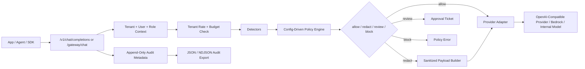
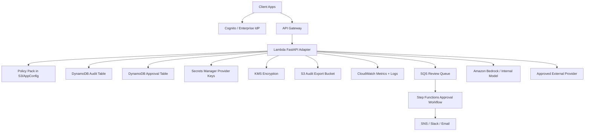

# Architecture

Context Firewall is designed as a policy enforcement point for LLM applications.

## Runtime Flow

## Control Plane

- `api/policies/default.json` is the policy source of truth.
- Policies can match finding type, label, severity, destination, provider, role, and aggregate risk.
- Provider allowlists are enforced before any live routing.
- Role limits prevent lower-trust roles from routing high-risk context externally.
- Usage limits cap per-tenant request rate and daily estimated-token volume.
- RBAC scopes audit, approval, metrics, policy admin, and audit export access in production mode.

## Data Boundary

- Raw prompts are used only in-memory during the request.
- Audit records store hashes, counts, route, user, role, tenant, provider, and policy version.
- Review tickets store sanitized content only.
- Provider payloads are built from sanitized messages.
- Audit exports contain metadata only and are intended for SIEM, Security Lake, or S3 retention.

## Why Deterministic Policy Comes First

The policy engine is deterministic because enforcement needs repeatability, explainability, and tests. LLM classifiers can be added as extra detectors, but they should not be the only source of a block/allow decision.

## AWS Production Shape

## Production Hardening Checklist

- Replace demo header identity with Cognito/JWT claims.
- Move policy packs to S3, AWS AppConfig, or a signed internal registry.
- Replace SQLite with DynamoDB.
- Add immutable log delivery to S3 or Security Lake.
- Add detector allowlists for known test data and false-positive exceptions.
- Add per-tenant encryption keys for approval artifacts.
- Tune rate limits and provider budget controls by tenant and role.
- Add structured metrics by policy id, decision, provider, tenant, and app.
